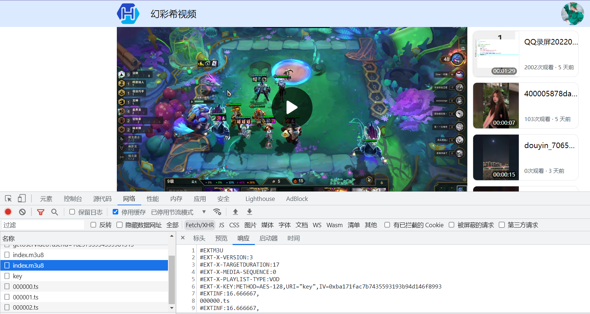

# 幻彩希视频 
### 上传解码视频
### 前端使用vue3+ts+ElementUI
### 后端使用Springboot+Mybatis-Plus+Sa-Token+Rabbitmq+Redis+ffmpeg

## 实现
    前端上传视频，后端将视频放到队列中，通过ffmpeg转码分片视频，
    通过ffmpeg的日志输出，获取到视频的时间和解码的进度，将进度保存到Redis中，
    前端通过轮询得到解码视频的进度。
    后端通过权限控制，控制每个视频的播放权限。

## 效果图

## 待解决的问题

    1、前端播放组件vue3-video-play@1.3.1-beta.6 右键菜单无法关闭等问题。
    2、前端上传时只能上传一个文件，后台可处理多个文件。
    3、后台用户权限过于简单。
    4、m3u8视频没有加强加密。
    5、获取视频解码进度有性能问题。
    6、上传待增加大文件分片上传功能。
